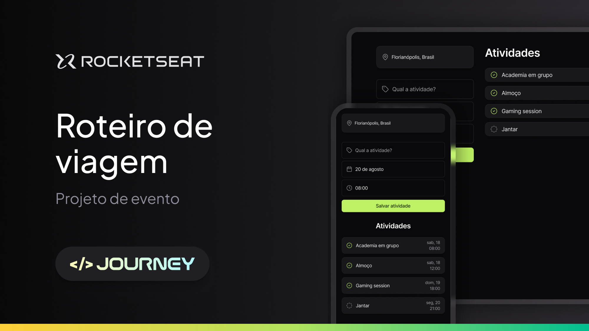

# Projeto Roteiro de viagem

## Sobre o projeto
> 
Neste projeto foi desenvolvido uma versão simplificada de um sistema de roteiro de viagem!
> 

## Tecnologias utilizadas
Esse projeto foi desenvolvido com as seguintes tecnologias:

- `HTML`
- `CSS`
- `JavaScript`

## Acesso ao projeto

É possível acessar o projeto através do [Link](https://github.com/Thamyresmya/NLW_Journey-HTML)

Neste repositório você tem acesso a todo o material desenvolvido.

## 🎨 Figma

💜 Acesse o [**link**](https://www.figma.com/community/file/1392277205162897872/nlw-journey-roteiro-de-viagem) do Figma aqui!

## Desenvolvedores

| [ Thamyres Cavalcante](https://github.com/Thamyresmya) |   |
| :---: | :---: 

## Me siga nas redes sociais

- [Linkedin](https://www.linkedin.com/in/thamyrescavalcante/)
- [Instagran](https://www.instagram.com/thamyres__cavalcante/)

 

---

### Feito com 💜 by Thamyres Cavalcante.
